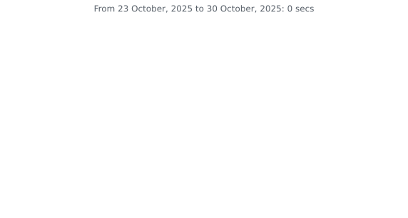

# Yannis Van Achter

## About me

I'm a computer science bachelor student at UNamur in Belgium. I'm passionate about technology and software development, and I'm always looking for new challenges and learning opportunities.

## Skills

<table>
  <tr>
    <th>Programming Languages</th>
    <th>Web development</th>
    <th>Databases</th>
    <th>Utils</th>
  </tr>
  <tr>
    <td>Python</td>
    <td>React.JS</td>
    <td>MySQL</td>
    <td>Git and GitHub</td>
  </tr>
  <tr>
    <td>JavaScript</td>
    <td>Node.JS</td>
    <td>PostgreSQL</td>
    <td>Docker</td>
  </tr>
  <tr>
    <td>TypeScript</td>
    <td>FastAPI</td>
    <td></td>
    <td></td>
  </tr>
  <tr>
    <td>HTML</td>
    <td></td>
    <td></td>
    <td></td>
  </tr>
  <tr>
    <td>CSS</td>
    <td></td>
    <td></td>
    <td></td>
  </tr>
</table>

## Education

- **2024-Current** Bachelor in Software development, Henallux (expected graduation 2027)
- **2021-2024** Bachelor in Computer Science, UNamur (Reorientation)

## Github Stats

## Global stats for last 7 days

### Wakatime languages stats

### Wakatime Projects stats

<!--
REMIND TO MYSELF : STUDY HOW TO CREATE README.: status: ok

TITRE
# h1
## h2
... max h6

LIST unsorted
* List
  * item

IMAGE
 // basic
// !image privée ou de droit public

  

GIF
// look giphy.com
same syntax as an image

VIDEO
// look Youtube
same syntax as an image

INSERT CODE
''' LANGUAGE
CODE
'''

QUOTES
> my text

PASS A KEY SYMBOL
use '\' 

Stat of my language
use 

USEFUL LINK TO CREATE A README.md
https://docs.github.com/en
https://docs.github.com/en/get-started/writing-on-github/getting-started-with-writing-and-formatting-on-github/basic-writing-and-formatting-syntax
-->
